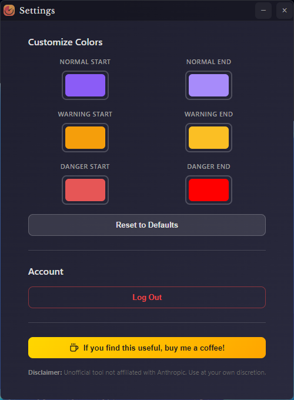

# Claude Usage Widget

A beautiful, standalone Windows desktop widget that displays your Claude.ai usage statistics in real-time.


## Features

- 🎯 **Real-time Usage Tracking** - Monitor both session and weekly usage limits
- 📊 **Visual Progress Bars** - Clean, gradient progress indicators
- ⏱️ **Countdown Timers** - Circular timers showing time until reset
- 🔄 **Auto-refresh** - Updates every 5 minutes automatically
- 🎨 **Modern UI** - Sleek, draggable widget with dark theme
- 🎨 **Customizable Colors** - Personalize progress bar colors for each usage level
- ⚙️ **Settings Panel** - Easy-to-use settings window for customization
- 🔒 **Secure** - Encrypted credential storage
- 📍 **Always on Top** - Stays visible across all workspaces
- 💾 **System Tray** - Minimizes to tray for easy access

## Installation

### Download Pre-built Release
1. Download the latest `Claude-Usage-Widget-Setup.exe` from [Releases](https://github.com/SlavomirDurej/claude-usage-widget/releases)
2. Run the installer
3. Launch "Claude Usage Widget" from Start Menu

### Build from Source

**Prerequisites:**
- Node.js 18+ ([Download](https://nodejs.org))
- npm (comes with Node.js)

**Steps:**

```bash
# Clone the repository
git clone https://github.com/yourusername/claude-usage-widget.git
cd claude-usage-widget

# Install dependencies
npm install

# Run in development mode
npm start

# Build installer for Windows
npm run build:win
```

The installer will be created in the `dist/` folder.

## Usage

### First Launch

1. Launch the widget
2. Click "Login to Claude" when prompted
3. A browser window will open - login to your Claude.ai account
4. The widget will automatically capture your session
5. Usage data will start displaying immediately

### Widget Controls

- **Drag** - Click and drag the title bar to move the widget
- **Refresh** - Click the refresh icon to update data immediately
- **Minimize** - Click the minus icon to hide to system tray
- **Close** - Click the X to minimize to tray (doesn't exit)

### System Tray Menu

Right-click the tray icon for:
- Show/Hide widget
- Refresh usage data
- Re-login (if session expires)
- Settings - Open customization panel
- Exit application

## Understanding the Display

### Current Session
- **Progress Bar** - Shows usage from 0-100%
- **Timer** - Time remaining until 5-hour session resets
- **Color Coding**:
  - Purple: Normal usage (0-74%)
  - Orange: High usage (75-89%)
  - Red: Critical usage (90-100%)

### Weekly Limit
- **Progress Bar** - Shows weekly usage from 0-100%
- **Timer** - Time remaining until weekly reset (Wednesdays 7:00 AM)
- **Same color coding** as session usage

## Customization

### Color Preferences

Customize the progress bar colors to match your preferences:

1. Right-click the system tray icon
2. Select "Settings"
3. Use the color pickers to customize each usage level:
   - **Normal** (0-74% usage) - Default: Purple gradient
   - **Warning** (75-89% usage) - Default: Orange gradient
   - **Danger** (90-100% usage) - Default: Red gradient
4. Changes apply instantly to the main widget
5. Click "Reset to Defaults" to restore original colors



### Auto-start on Windows Boot

1. Press `Win + R`
2. Type `shell:startup` and press Enter
3. Create a shortcut to the widget executable in this folder

### Custom Refresh Interval

Edit `src/renderer/app.js`:
```javascript
const UPDATE_INTERVAL = 5 * 60 * 1000; // Change to your preference (in milliseconds)
```

## Troubleshooting

### "Login Required" keeps appearing
- Your Claude.ai session may have expired
- Click "Login to Claude" to re-authenticate
- Check that you're logging into the correct account

### Widget not updating
- Check your internet connection
- Click the refresh button manually
- Ensure Claude.ai is accessible in your region
- Try re-logging in from the system tray menu

### Widget position not saving
- Window position is now saved automatically when you drag it
- Position will be restored when you restart the app

### Build errors
```bash
# Clear cache and reinstall
rm -rf node_modules package-lock.json
npm install
```

## Privacy & Security

- Your session credentials are stored **locally only** using encrypted storage
- No data is sent to any third-party servers
- The widget only communicates with Claude.ai official API
- Session cookies are stored using Electron's secure storage

## Technical Details

**Built with:**
- Electron 28.0.0
- Pure JavaScript (no framework overhead)
- Native Node.js APIs
- electron-store for secure storage

**API Endpoint:**
```
https://claude.ai/api/organizations/{org_id}/usage
```

**Storage Location:**
```
%APPDATA%/claude-usage-widget/config.json (encrypted)
```

## Roadmap

- [ ] macOS support
- [ ] Linux support
- [x] Custom color themes
- [ ] Notification alerts at usage thresholds
- [x] Remember window position
- [x] Settings panel
- [ ] Usage history graphs
- [ ] Multiple account support
- [ ] Keyboard shortcuts

## Contributing

Contributions are welcome! Please feel free to submit a Pull Request.

## License

MIT License - feel free to use and modify as needed.

## Disclaimer

This is an unofficial tool and is not affiliated with or endorsed by Anthropic. Use at your own discretion.

## Support

If you encounter issues:
1. Check the [Issues](issues) page
2. Create a new issue with details about your problem
3. Include your OS version and any error messages

---

Made with ❤️ for the Claude.ai community
